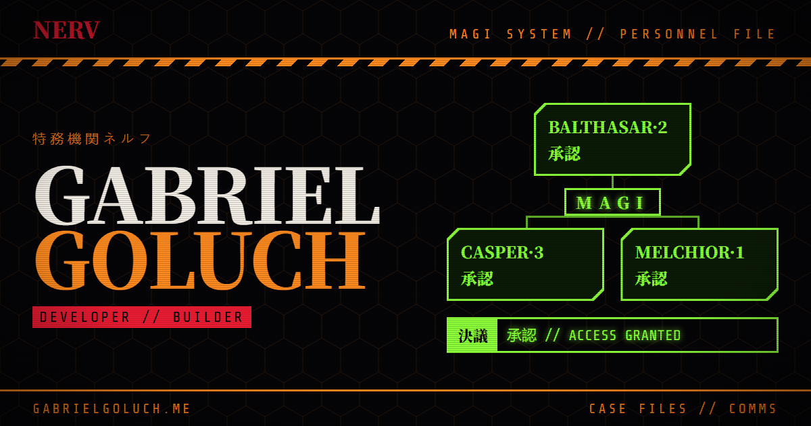

# gabrielgoluch.me



My personal site: a portfolio and link hub styled after the MAGI supercomputer from *Neon Genesis Evangelion*.

**Live:** [gabrielgoluch.me](https://gabrielgoluch.me)

## Features

- **MAGI boot sequence** on first visit, with a shorter boot for returning visitors.
- **MAGI deliberation** hero where Melchior, Balthasar and Casper vote on the visitor.
- **NERV case files** for projects, with hover-to-declassify redactions and live GitHub stats.
- **Comms terminal** for social links and an optional résumé download.
- **NERV ID card maker**: visitors issue themselves a personnel card, drawn on a canvas and downloaded as a PNG. Photos never leave their device.
- **S-DAT player** looping tracks 25 and 26, like Shinji's.
- **MAGI terminal**: press `` ` `` (or the footer button) for a command line. Try `help`.
- **Tokyo-3 time of day**: a sunset tint in the evening and a moon at night, from the visitor's clock.
- **Soft UI sounds**, synthesized with the Web Audio API and off by default.
- **Accessible motion**: everything still works with reduced motion turned on.
- Some things only show up if you go looking.

## Stack

React 19, Vite 8 and Tailwind CSS 4, deployed to GitHub Pages by GitHub Actions on every push to `main`.

## Running locally

```bash
npm install
npm run dev      # http://localhost:5173  (add ?boot to replay the boot sequence)
npm run build    # production build in dist/, with the page prerendered
npm run lint
```

## Editing content

All content lives in `src/data/`:

| File | What it controls |
| --- | --- |
| `profile.js` | Name, tagline, the plain-language summary, and the three MAGI panels |
| `projects.js` | Case files (projects). Field docs are at the top of the file |
| `socials.js` | Comms channels |
| `site.js` | Live URL, résumé path, GoatCounter analytics and the visitor counter |

## Search engines

- **Prerendered HTML**: `npm run build` renders the app once with React's server renderer (`src/entry-server.jsx`, `scripts/prerender.js`) and writes the markup into `dist/index.html`, so crawlers see the text without running JavaScript. In the browser, the live app replaces it.
- **Structured data**: a schema.org `Person` (name, school, profile links) is generated from `src/data/` by a plugin in `vite.config.js`. Validate it with [Google's Rich Results Test](https://search.google.com/test/rich-results).
- **Sitemap**: `sitemap.xml` is generated at build time with the build date as `lastmod`. `robots.txt` points to it.
- The `<title>` and description in `index.html` are deliberately plain. They're what Google shows in results.

## Security

- **Content-Security-Policy** is added to production builds by a plugin in `vite.config.js`. Any new outside service (a new API, font host or analytics domain) must be added to that policy or the browser will block it.
- **GoatCounter's script is self-hosted** in `public/vendor/goatcounter.js` so a change on their server can't alter what runs here.
- **GitHub Actions are pinned to commit SHAs**, and Dependabot opens weekly PRs for Actions and npm updates.
- The deploy fails if `npm audit` finds a high-severity vulnerability in a production dependency.

## Link preview image

`public/og-image.png` is rendered from `scripts/og-image.html` with headless Chrome:

```bash
chrome --headless=new --hide-scrollbars --force-device-scale-factor=1 \
  --window-size=1200,630 --virtual-time-budget=8000 \
  --screenshot=public/og-image.png scripts/og-image.html
```

On Windows, `chrome` is usually `"C:\Program Files\Google\Chrome\Application\chrome.exe"`.

---

Fan-made tribute. *Neon Genesis Evangelion* belongs to its respective owners.
